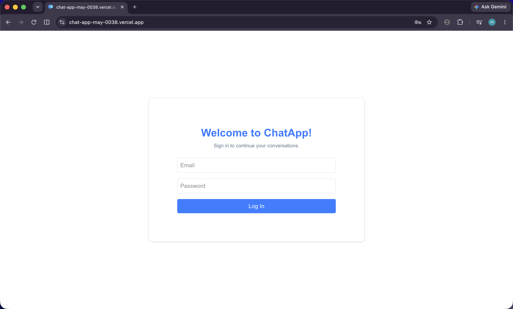
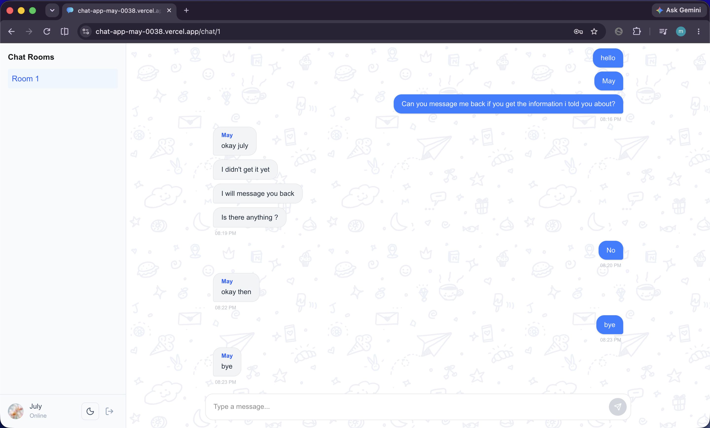
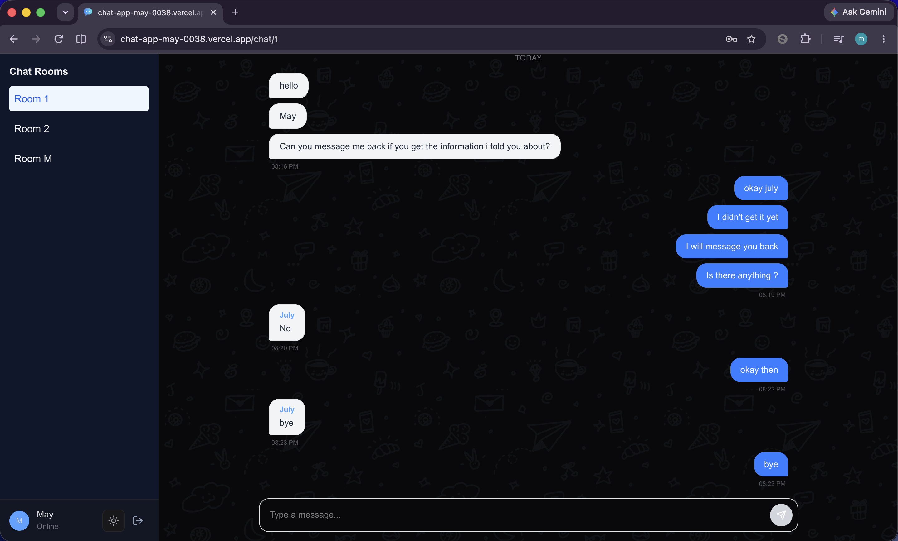

# 💬 Real-Time Chat Application

A full-stack, real-time messaging application built with **Next.js 16**, **FastAPI**, **WebSockets**, and **Firebase**. Features custom JWT authentication stored in secure `HttpOnly` cookies, real-time bidirectional messaging, state management with Redux Toolkit, and Tailwind CSS dark/light theme switching.


---

## 🔗 Live Demo & Screenshots

- **Live Application:** [https://chat-app-may-0038.vercel.app](https://chat-app-may-0038.vercel.app)
- **API Documentation (Swagger):** [https://chatapp-backend-736340093630.us-central1.run.app/docs](https://chatapp-backend-736340093630.us-central1.run.app/docs)


| Login & Authentication | Light Workspace | Dark Workspace |
| :---: | :---: | :---: |
|  |  |  |

---

### 🔑 Demo Credentials

Test live messaging between multiple active user sessions:

| Account | Email | Password |
| :--- | :--- | :--- |
| **Primary Test User** | `maykhaing@gmail.com` | `12345678` |
| **Secondary Test User** | `july1234@gmail.com` | `12345678` |

---

## ✨ Features

- ⚡ **Real-Time Messaging & Typing Indicators:** Low-latency, bidirectional WebSocket connection for instant message delivery and real-time "user is typing..." indicators without database overhead.
- 🔐 **Dual-Layer Authentication:** Firebase Authentication integrated with custom FastAPI JWT tokens delivered via secure `HttpOnly` cookies.
- 🎨 **Modern UI & Themes:** Fully mobile-responsive design built with Tailwind CSS v4, `next-themes` for seamless light/dark mode, dynamic user avatars, formatted message timestamps, and custom hand-drawn background art
- 📱 **Multi-Room Chat & Persistence:** Join different chat rooms with persistent message history powered by Firestore.
- 🔄 **Automated CI/CD:** Fully configured GitHub Actions pipeline running linting, type-checking, and test suites on every pull request.

---

## 🛠️ Tech Stack

### Frontend 🎨
- **Framework:** Next.js 16 (App Router, React 19, TypeScript)
- **State Management:** Redux Toolkit
- **Styling:** Tailwind CSS v4, Lucide Icons 
- **Theme Management:** `next-themes` 
- **Real-Time Communications:** WebSockets API
- **Testing:** Jest & React Testing Library

### **Backend** ⚙️
- **Framework:** FastAPI (Python)
- **Protocol:** WebSockets & REST API
- **Database:** Google Cloud Firestore
- **Authentication:** Firebase Admin SDK & Custom JWT
- **Linting & Typing:** Ruff & Pyright


### **DevOps & Infrastructure**
- **CI/CD Pipeline:** GitHub Actions (Automated Linting, Type-Checking, and Unit Tests)
- **Frontend Hosting:** Vercel
- **Backend Hosting:** Google Cloud Run 
- **Containerization:** Docker


## 🏗️ Architecture & Authentication Flow

```text
[ Next.js Frontend ]
        │
        ├───( 1. Auth Credentials )─────────> [ Firebase Auth ]
        │                                             │
        │<──( 2. Return Firebase ID Token )───────────┘
        │
        └───( 3. Send ID Token for Auth )───> [ FastAPI Backend ]
                                                      │
        ┌─────────────────────────────────────────────┤
        │                                             │
        ├───( 4. Set HttpOnly Cookie )───────────────>│
        ├───( 5. WS Handshake with Cookie )──────────> [ Real-Time Chat Engine ]
        └───( 6. Persist Messages )──────────────────> [ Cloud Firestore ]
```


### 🎯 Key Engineering Decisions
- **Why Custom JWT on top of Firebase?** Firebase manages user identity, but custom JWTs allow custom backend permissions, clean session handling across REST endpoints and WebSocket connections, and prevention of XSS token leakage via `HttpOnly` cookies.
- **Why WebSockets over HTTP Polling?** Reduces HTTP overhead and latency, enabling instantaneous message delivery across active room members.

---

### 🔄 Automated CI/CD (GitHub Actions)
This repository includes a pre-configured CI CD pipeline (.github/workflows/pipeline.yml) running on push/PR to main:

**Frontend Jobs**: Installs dependencies (npm ci), runs ESLint, runs Jest test suites, and builds Next.js binaries.

**Backend Jobs**: Configures Python 3.11, lints with Ruff, enforces strict type-checking with Pyright, and executes automated unit tests with Pytest.
- Automated Deployment: Automatically builds Docker containers and deploys backend services to Google Cloud Run upon merging to main.

---

## 🚀 Getting Started

### **Prerequisites**
- Node.js (v18+)
- Python (v3.10+)

---

### **1. Backend Setup (FastAPI)**

```bash
# Navigate to backend folder
cd backend

# Create virtual environment
python -m venv venv
source venv/bin/activate  # On Windows: venv\Scripts\activate

# Install dependencies
pip install -r requirements.txt

# Create .env file from template
cp .env.example .env

# Configure .env:
APP_SECRET=your_jwt_secret_key
FIREBASE_API_KEY=your_firebase_api_key
FIREBASE_CREDENTIALS=serviceAccount.json

# Run locally:
uvicorn main:app --reload --port 8000
```

### **2. Frontend Setup (Next.js)**

```bash
# Navigate to frontend folder
cd frontend

# Install dependencies
npm install

# Configure environment variables
cp .env.example .env.local

# Configure .env:
NEXT_PUBLIC_API_BASE_URL=http://localhost:8000

# Run development server:
npm run dev
```


### ⚡ WebSocket & Security Rules

- **Pre-Connection Verification:** WebSocket connections require a valid `HttpOnly` JWT cookie before the handshake is accepted.
- **Access Control:** Users can only join and stream messages from rooms where their `user_id` is in the room's membership list.
- **Real-Time Pipeline:** Incoming WebSocket messages are immediately saved to Firestore and broadcasted to active room subscribers in real time.


## 💻 API Reference

### Authentication Endpoints
| Method | Endpoint        | Description |
|------|-----------------|-------------|
| POST | /auth/signup     | Signup user | 
| POST | /auth/login     | Login user |
| POST | /auth/logout    | Logout user |
| GET  | /auth/me      | Get current user profile |
| PATCH  | /auth/me      | Update current user details |

### Chat & WebSockets
| Method | Endpoint                       | Description |
|------|--------------------------------|-------------|
| GET  | /rooms/{room_id}/messages      | Fetches historical messages for a room |
| WS   | /ws/rooms/{room_id}            | Real-time WebSocket connection for room messages & typing status events |

## 🗄️ Firestore Database Schema

```text
chatrooms (collection)
 └── {room_id} (document)
      ├── name: string
      ├── createdAt: timestamp
      ├── members: array [user_id]
      └── messages (subcollection)
           └── {message_id} (document)
                ├── senderId: string
                ├── name: string
                ├── photoUrl: string
                ├── text: string
                ├── timestamp: timestamp
                └── createdAt: timestamp              
```


## 📜 License

Distributed under the MIT License. See `LICENSE` for details.


